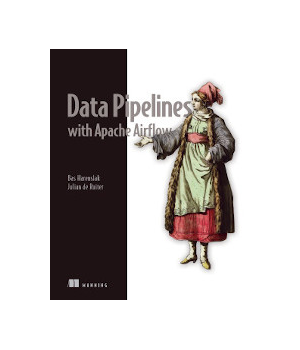

# Data Pipelines with Apache Airflow
Implementation for several chapters of book "Data Pipelines with Apache Airflow" by Bas Harenslak and Julian de Ruiter (ISBN 9781617296901).

# Usage
- Within each folder execute the docker-compose.yaml files.
- Open Airflow UI: http://localhost:8080
- Trigger and inspect all DAGs via UI

